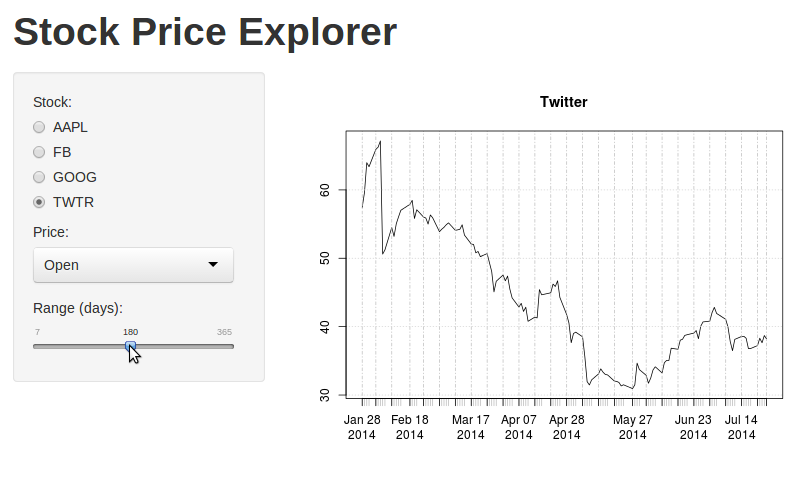

## Get started with shiny!

* Project for Developing Data Products class on Coursera:
  * Shiny app to explore historical data for stock prices
  * Use "quantmod" R package to access the data

```r
library(quantmod)
```

```
## Loading required package: Defaults
## Loading required package: xts
## Loading required package: zoo
## 
## Attaching package: 'zoo'
## 
## The following objects are masked from 'package:base':
## 
##     as.Date, as.Date.numeric
## 
## Loading required package: TTR
## Version 0.4-0 included new data defaults. See ?getSymbols.
```
* Hands-on experience with shiny package:
  * Building UI using predefined UI blocks
  * Using different interactive widgets for user input
  * Implementing reactive processing of user input
  * Sending produced plot of stock prices from server back to UI
* Next three slides show features available in the app!

---

## (1/3) Stock selection

* Select one of the following stocks: AAPL, FB, GOOG, TWTR


---

## (2/3) Price type selection

* Choose one of the following price types: open, high, low, close


---

## (3/3) Range of dates selection

* Select range of dates 



